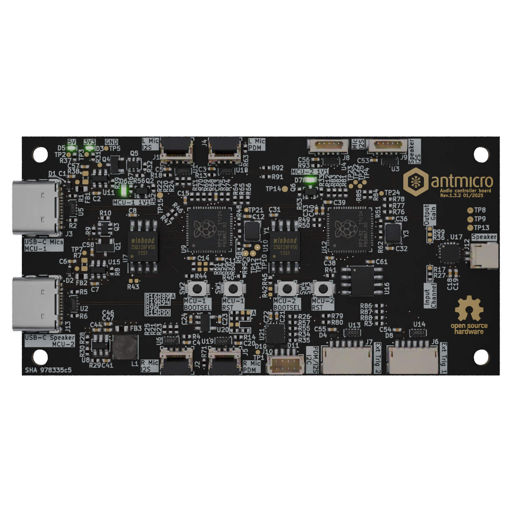

# Audio controller board

## Overview
This project contains design files for a audio latency processing board.

The design files were prepared in KiCad 8.x.

## Key features
* MAX98357A Class-D Amplifier
* 2x RP2040 MCU

## Project structure
The main directory contains KiCad PCB project files and a README. 
The remaining files are stored in the following directories:

* `doc` - contains schematic file in PDF format
* `assets` - contains visual assets for showcasing this design
