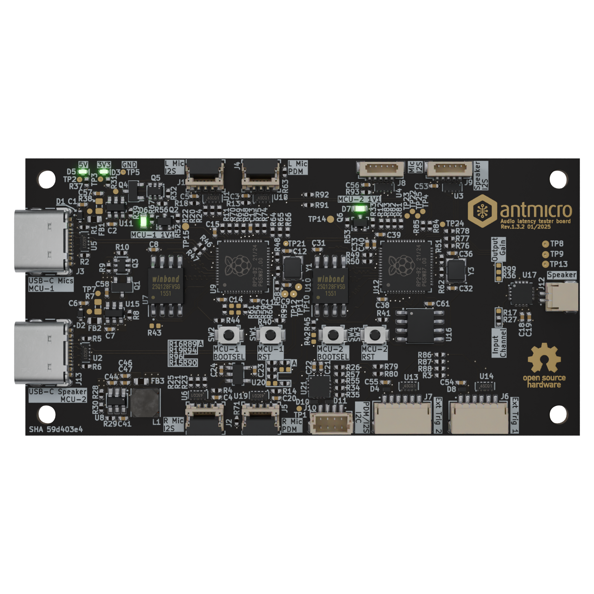

# Audio controller board

Copyright (c) 2024-2025 [Antmicro](https://www.antmicro.com)

## Overview

This project contains design files for an audio latency processing board. The system allows driving an external speaker and collecting audio samples from a pair of PDM or I2S microphones. The board was designed to work with a host processing platform that generates playback and processes the captured audio samples.

The design files were prepared in KiCad 8.x.

## Key features

* 2x RP2040 MCU
* MAX98357A, I2S Class D Amplifier
* Zero insertion force connectors for a 5 pin, 0.5 mm pitch FFC
* 32Mb SerialRAM for playback sample buffering
* Various I/O configurations for trigger signals
* Small form factor: 80mm x 40mm

## Project structure

The main directory contains KiCad PCB project files, a LICENSE, and a README.
The remaining files are stored in the following directories:

* `doc` - contains schematics in PDF format
* `assets` - contains visual assets for showcasing this design on [Open Hardware Portal](https://openhardware.antmicro.com) and [System Designer](https://designer.antmicro.com)

## Licensing

This project is published under the [Apache-2.0](LICENSE) license.